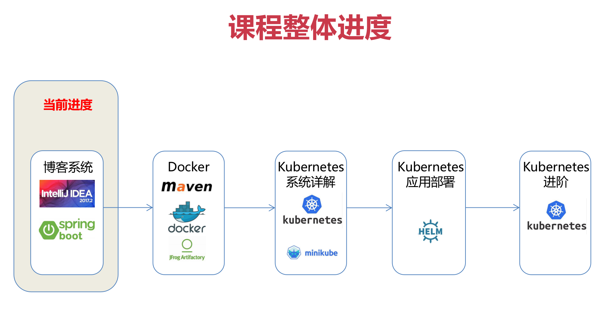
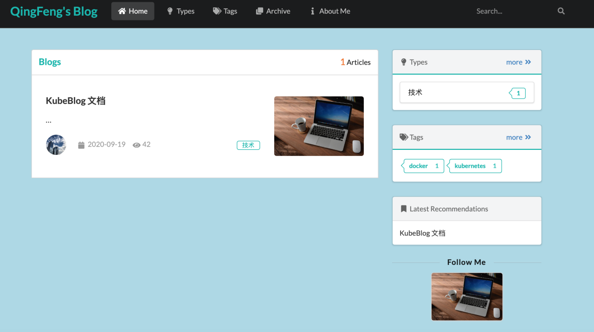

# 第二章 课前准备之SpringBoot博客系统
学习目标：
1. 熟悉 Spring Boot 博客应用 kubeblog的架构，功能
2. 安装 Docker，mysql，IDEA，Maven
3. 掌握博客项目的打包，运行

# 2-1 如何获取使用博客源码

# 2-2 博客应用演示

## 

1. 首页
- 查看博客，留言，Tag过滤
- 关键字查询
2. 管理员控制台
- 写博客
- 留言
- Tag管理


# 2-3 Spring Boot 博客应用代码整体介绍（JPA，Thymleaf）
## 2.3.1 博客项目代码特色
- 清新，优雅的 UI 设计
- 实际可用的技术博客系统
- 支持 MarkDown 编辑
- 支持后台管理系统
- 支持评论，留言回复，打赏
- 为你的个人技术背景加分

1. 前端
    - Thymeleaf 模板渲染引擎
    - SemanticUI 程序员也能写出专业设计师风格的页面
2. 后端
    - SpringBoot 业界主流框架
3. 数据层
    -JPA 持久化数据访问
    -Mysql 关系型数据库


# 2-4 博客应用开发环境搭建-IDEA，Maven

## 环境准备

1. 下载并安装 Mavmen
- 下载：http://maven.apache.org/download.cgi
- 安装
```
unzip apache-maven-3.6.3-bin.zip
vi ~/.bash_profile
增加一行：
export PATH=/Users/qing/Documents/tools/apache-maven-3.3.6/bin:$PATH 
```
保存退出，然后刷新配置
```
source ~/.bash_profile
```

2. 下载IDEA
- https://www.jetbrains.com/idea/download/
3. 配置 IDEA

# 2-5 安装Docker以及环境配置
本文假设您已经在 Virtualbox 上安装了 Centos7 系统。
## 配置虚拟机免密登录
- 生成秘钥
```
 ssh-keygen
```
- 查看生成的秘钥
```
cat ~/.ssh/id_rsa.pub
``` 
- 拷贝公钥到虚拟机上
```
ssh-copy-id -i .ssh/id_rsa.pub  root@192.168.0.101
```

## 在 Centos7 系统上安装Docker
1. 添加依赖

yum install -y yum-utils device-mapper-persistent-data lvm2

2. 设置yum源
yum-config-manager --add-repo https://download.docker.com/linux/centos/docker-ce.repo
　

3. 查看仓库中所有Docker版本
yum list docker-ce --showduplicates | sort -r
　
4. 安装Docker
　　　
yum -y install docker-ce

5. 启动并加入开机启动
systemctl start docker
systemctl enable docker

# 2-6 安装 Mysql Server 和 Mysq Workbench
## 环境准备

1. 挂载外部持久化配置和数据目录
```
mkdir /opt/mysql
mkdir /opt/mysql/conf.d
mkdir /opt/mysql/data/
```
 
创建my.cnf配置文件(文件在代码库第二章获取)
```
touch /opt/mysql/my.cnf
```

my.cnf添加如下内容：
```
[mysqld]
user=mysql
character-set-server=utf8
default_authentication_plugin=mysql_native_password
secure_file_priv=/var/lib/mysql
expire_logs_days=7
sql_mode=STRICT_TRANS_TABLES,NO_ZERO_IN_DATE,NO_ZERO_DATE,ERROR_FOR_DIVISION_BY_ZERO,NO_ENGINE_SUBSTITUTION
max_connections=1000

[client]
default-character-set=utf8

[mysql]
default-character-set=utf8
```

2. 运行 Mysql Docker 镜像
```shell
docker run \
--name mysql57 \
-p 3306:3306 \
-v /opt/mysql/data:/var/lib/mysql \
-v /opt/mysql/log:/var/log/mysql \
-v /opt/mysql/my.cnf:/etc/mysql/my.cnf:rw \
-e MYSQL_ROOT_PASSWORD=123123 \
-d mysql:5.7.30 --default-authentication-plugin=mysql_native_password
```

3. 登录 mysql server，设置 root 密码
mysql -uroot -p
UPDATE mysql.user SET host='%' WHERE user='root';
flush privileges;


4. 安装Mysql client
- 添加rpm源
 rpm -ivh https://repo.mysql.com//mysql57-community-release-el7-11.noarch.rpm

- 安装x64位的 mysql客户端
 yum install mysql-community-client.x86_64 -y 
- 登录 mysql server
mysql -h 127.0.0.1 -uroot -p
输入密码：password

-创建数据库 blogDB
CREATE DATABASE IF NOT EXISTS blogDB DEFAULT CHARSET utf8 COLLATE utf8_general_ci;

# 2-7 博客应用编译，打包，运行

## 1. 项目编译，打包
在 IDEA 里设置 Maven 项目。
```
docker run -it --rm --name maven -v "$(pwd)":/usr/src/mymaven -w /usr/src/mymaven -p 5000:5000 -d maven:latest sh -c "while true; do echo hello; sleep 10;done"
docker run -di -p 5000:5000 -v "$(pwd)":/test -w /test --name=jdk1.8 kdvolder/jdk8
cd Final
mvn package
```

## 2. 运行博客项目
```
java -jar target/kubeblog.jar
```
- 访问博客用户端：http://localhost:5000
- 访问博客管理员端：http://localhost:5000/admin, 用户名密码 admin/password


