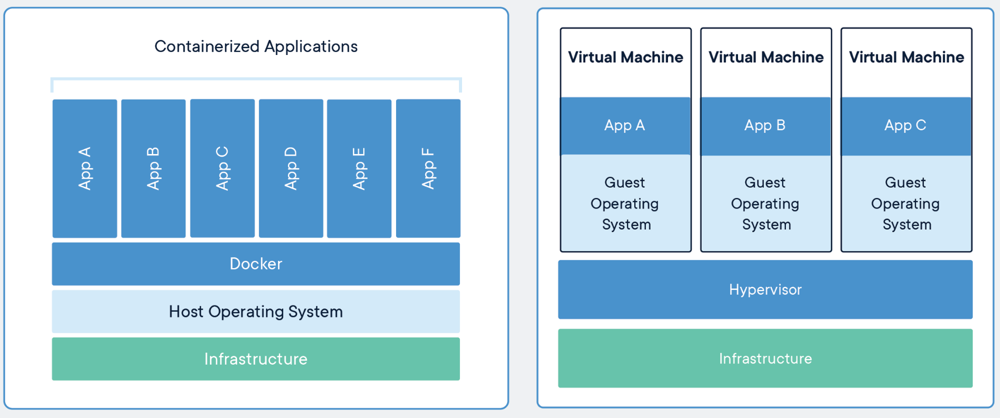
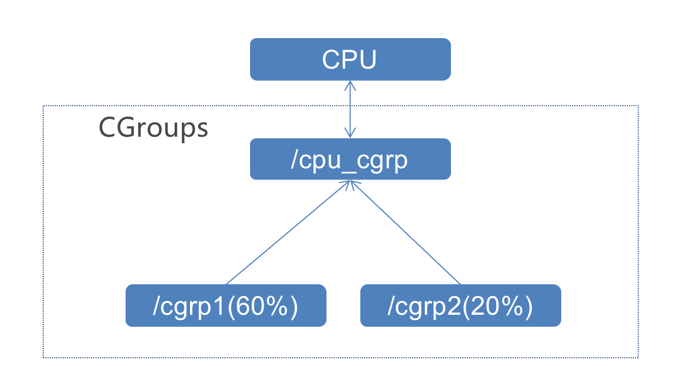

# 3-1 为什么需要Docker？k8s与Docker的关系？
## 3.1.1 Docker VS 虚拟机

官方解释：Package Software into Standardized Units for Development, Shipment and Deployment.

# 3.2 Docker namespace 隔离
1. Docker通过 Namespace 实现进程隔离
```
int clone(int (*child_func)(void *), void *child_stack, int flags, void *arg);
```
2. Docker 的实现原理：Docker 如何通过 Namespace 聚合进程，实现进程间隔离。
```
docker run -d -p 8083:8083  nginx
ps -ef|grep docker 
ls -al /proc/[PID]/ns

```

# 3.3 Docker 的资源配额 CGroups
1. Docker 使用CGroups实现资源的配额管理。
- Cgroups (control groups)
- 2007年由谷歌工程师研发
- 2008年并入 Linux Kernel 2.6.24
- C语言实现
2. CGroups 限制进程的 CPU使用时间。 
Docker中的 CPU，内存，网络的限制均通过 cgroups 实现 

3. 实践
在宿主机上创建一个让 CPU 飙升到100%的进程： （此操作有风险，慎用）
```
while : ; do : ; done &
```
记录下 PID = 27358
```
cd /sys/fs/cgroup/cpu
mkdir cgroups_test
echo 20000 > /sys/fs/cgroup/cpu/cgroups_test/cpu.cfs_quota_us
echo 27358 > /sys/fs/cgroup/cpu/cgroups_test/tasks
```
清理该进程 
```
Kill -9 27358 
```
4. docker 里如何加参数进行资源配额
docker run -it --cpus=".5" nginx /bin/sh
进入容器查看是否有对应的 cgroup 设置
```
cd /sys/fs/cgroup/cpu
cat cpu.cfs_quota_us
```
配置显示 500000，证明--cpus=".5"的参数已经生效


# 3-4 Docker镜像
## 3.4.1 Docker镜像的由来
- 虽然 Docker 实现了运行环境的隔离，但如何将一个运行的容器快速进行启动，复制，迁移到其他的主机上运行？

- 如果容器无法快速进行复制，迁移，那么和以 VMware 为代表的虚拟化技术相比并没有太多优势

## 3.4.2 Docker 镜像的特性

- Docker 镜像具备了应用运行所需要的所有依赖

- 一次构建，处处运行

- Docker 镜像的存储是基于 checksum 的去重存储，大大降低存储空间

## 3.4.3 Docker 镜像常用命令

- 下载 Docker 镜像
docker pull nginx
- 为镜像打版本号
docker tag 
- 上传 Docker 镜像
docker push


# 3-5 编写博客 应用的 Dockerfile
```
FROM openjdk:8-jdk-alpine
MAINTAINER QingFeng
VOLUME /tmp
ADD target/kubeblog.jar /kubeblog.jar
EXPOSE 5000
ENTRYPOINT ["java","-jar","/kubeblog.jar"]
```
# 3-6 为博客应用构建 Docker 镜像
- 增加 mysql57 hosts 记录，作为数据库的域名
```
vi /etc/hosts
127.0.0.1    mysql57
```
- 下载代码,构建 mvn package
```
git clone <git url>
cd /root/kubeblog/Final
mvn package
```

- 构建 Docker 镜像
```

docker build -t kubeblog .
```
- 查看 docker 镜像
```
docker images
REPOSITORY          TAG                 IMAGE ID            CREATED             SIZE
kubeblog            1.0                 f9bb30633155        4 minutes ago       148MB
```

# 3-7 Docker run --link运行博客应用
- docker run --link运行博客应用
```
docker run --name kubeblog -d -p 5000:5000  --link mysql57 kubeblog:1.0
```
-进入容器查看环境变量 evn
```
docker exec -it kubeblog sh
env |grep MYSQL
MYSQL57_ENV_MYSQL_MAJOR=5.7
MYSQL57_PORT_3306_TCP_ADDR=172.17.0.2
MYSQL57_ENV_MYSQL_ROOT_PASSWORD=password
MYSQL57_ENV_GOSU_VERSION=1.12
MYSQL57_PORT_3306_TCP_PORT=3306
MYSQL57_PORT_3306_TCP_PROTO=tcp
MYSQL57_PORT_33060_TCP_ADDR=172.17.0.2
MYSQL57_PORT=tcp://172.17.0.2:3306
MYSQL57_PORT_3306_TCP=tcp://172.17.0.2:3306
MYSQL57_PORT_33060_TCP_PORT=33060
MYSQL57_ENV_MYSQL_VERSION=5.7.30-1debian10
MYSQL57_PORT_33060_TCP_PROTO=tcp
MYSQL57_NAME=/kubeblog/mysql57
MYSQL57_PORT_33060_TCP=tcp://172.17.0.2:33060
```
- 更新/etc/hosts文件
cat /etc/hosts
127.0.0.1	localhost
::1	localhost ip6-localhost ip6-loopback
fe00::0	ip6-localnet
ff00::0	ip6-mcastprefix
ff02::1	ip6-allnodes
ff02::2	ip6-allrouters
172.17.0.2	mysql57 401b104b930a
172.17.0.3	2028007380c4

- 在宿主机访问 centos 虚拟机上的 kubeblog 应用，需要关闭虚拟机防火墙
```
systemctl stop firewalld
192.168.99.101:5000
```

