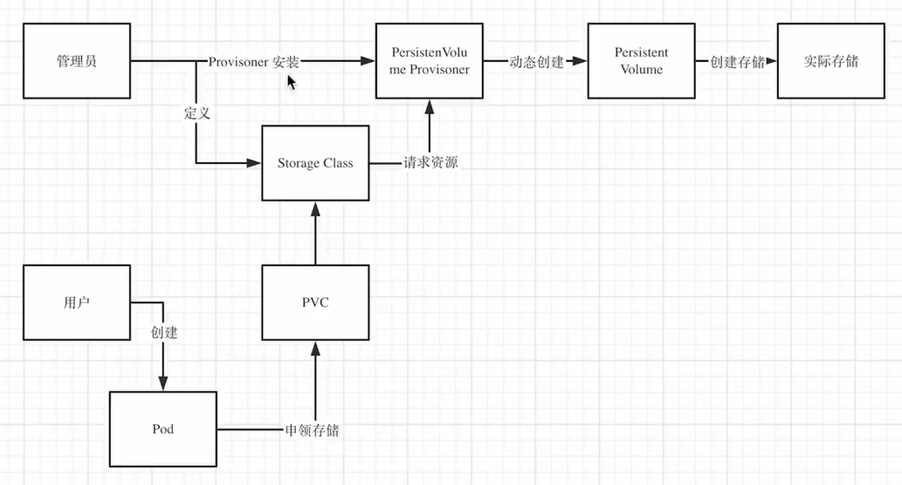

# volume
[官方文档](https://kubernetes.io/zh/docs/concepts/storage/volumes/)

hostPath `kubectl create -f 8-1-hostPath.yaml`

## 创建nfs服务
```shell
# 注意 只需要在master上开启服务,node节点上只需安装服务即可
yum -y install nfs-utils

[root@master chapter8]# cat /etc/exports
/nfsdata *(rw,sync,no_root_squash)

[root@master chapter8]# systemctl enable --now rpcbind
[root@master chapter8]# systemctl enable --now nfs

kubectl create -f 8-2-nfs.yaml 
kubectl describe pod myapp
kubectl exec -it myapp bash
cd /nfsdata/
ls
cat test.txt 
```


# 持久化卷
```shell
[root@master chapter8]# kubectl create -f 8-3-pv.yaml 
persistentvolume/pv-demo created

[root@master chapter8]# kubectl get pv
NAME      CAPACITY   ACCESS MODES   RECLAIM POLICY   STATUS      CLAIM   STORAGECLASS   REASON   AGE
pv-demo   5Gi        RWO            Recycle          Available                                   52s

kubectl create -f 8-4-pvc.yaml

[root@master chapter8]# kubectl get pv
NAME      CAPACITY   ACCESS MODES   RECLAIM POLICY   STATUS   CLAIM              STORAGECLASS   REASON   AGE
pv-demo   5Gi        RWO            Recycle          Bound    default/pvc-demo                           3m35s
```
# storage class

[官方文档](https://kubernetes.io/zh/docs/concepts/storage/dynamic-provisioning/)

```shell
[root@master chapter8]# kubectl apply -f 8-6-nfs-client-provisioner.yaml 
deployment.apps/nfs-client-provisioner created
[root@master chapter8]# kubectl apply -f 8-6-rbac.yaml 
serviceaccount/nfs-client-provisioner created
clusterrole.rbac.authorization.k8s.io/nfs-client-provisioner-runner created
clusterrolebinding.rbac.authorization.k8s.io/run-nfs-client-provisioner created
role.rbac.authorization.k8s.io/leader-locking-nfs-client-provisioner created
rolebinding.rbac.authorization.k8s.io/leader-locking-nfs-client-provisioner created
[root@master chapter8]# kubectl apply -f 8-6-p
8-6-pod.yaml  8-6-pvc.yaml  
[root@master chapter8]# kubectl apply -f 8-6-storage-class.yaml 
storageclass.storage.k8s.io/managed-nfs-storage created
[root@master chapter8]# kubectl apply -f 8-6-pvc.yaml 
persistentvolumeclaim/test-claim created
[root@master chapter8]# kubectl get pvc
NAME         STATUS    VOLUME                                     CAPACITY   ACCESS MODES   STORAGECLASS          AGE
pvc-demo     Bound     pv-demo                                    5Gi        RWO                                  30m
test-claim   Bound     pvc-74abdace-b8e6-4a34-93a4-7b2b722e564d   1Mi        RWX            managed-nfs-storage   59s
www-web-0    Pending                                                                        my-storage-class      3h29m
[root@master chapter8]# kubectl apply -f 8-6-pod.yaml 
pod/test-pod created
[root@master chapter8]# kubectl get pods
NAME                                      READY   STATUS      RESTARTS   AGE
nfs-client-provisioner-6976b6b79c-rg4jz   1/1     Running     0          2m49s
test-pod                                  0/1     Completed   0          18s
[root@master chapter8]# ll /nfsdata/
default-test-claim-pvc-74abdace-b8e6-4a34-93a4-7b2b722e564d/ test.txt                                                     
[root@master chapter8]# ll /nfsdata/default-test-claim-pvc-74abdace-b8e6-4a34-93a4-7b2b722e564d/SUCCESS
```